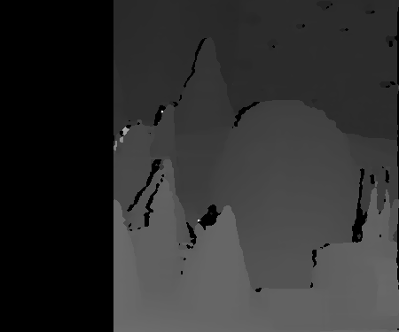
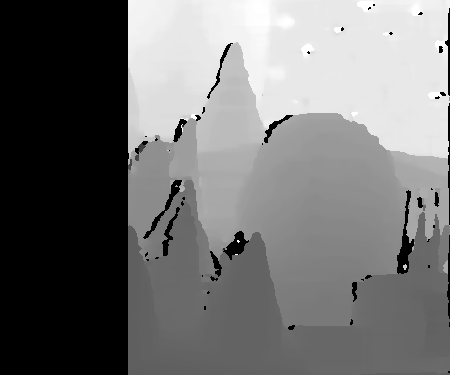

# Real‑Time Industrial ROS2 Vision Pipeline

A complete **ROS 2 + Python + OpenCV** pipeline for stereo camera calibration, rectification, depth estimation, and 3D point‑cloud reconstruction.  
This project demonstrates the journey from raw stereo images to disparity maps, depth maps, and 3D geometry using a modular ROS 2 package.

---

## 1. Introduction

Robotic systems need to perceive depth to navigate, manipulate objects, and interact with the environment.  
This project builds a **stereo vision pipeline** that:

- Takes two input camera images (left & right)  
- Calibrates and rectifies them  
- Computes disparity and depth  
- Generates a 3D point cloud  

The system is modular, with each step implemented as a ROS 2 node communicating via topics, similar to how industrial and research robots are designed.

---

## 2. Datasets

- **Aloe Stereo Pair (OpenCV test data)**  
  Used as a demonstration input; provides a clean stereo image pair for rectification and disparity testing.  

- **KITTI Stereo 2015**  
  Urban driving stereo image pairs with ground truth disparity; widely used in autonomous driving research.  

- **Middlebury Stereo Dataset**  
  High-resolution indoor stereo pairs for calibration and benchmarking.  

These datasets were chosen because they are **public, well-documented, and reproducible**, making the results comparable to standard baselines.

---

## 3. ROS2 Nodes Overview

| Node                  | Role & Function                                                                                  | Publishes                                    | Subscribes                                |
|-----------------------|-------------------------------------------------------------------------------------------------|----------------------------------------------|-------------------------------------------|
| `file_image_publisher`| Publishes a test stereo pair (`left.png`, `right.png`) simulating live camera feeds              | `/camera/left/image_raw`, `/camera/right/image_raw` | — |
| `stereo_rectify_node` | Uses calibration YAMLs to undistort & align images                                               | `/stereo/left_rect`, `/stereo/right_rect`   | `/camera/left/image_raw`, `/camera/right/image_raw` |
| `depth_sgbm_node`     | Runs OpenCV SGBM to compute disparity; converts disparity to depth (float32 meters)              | `/stereo/disparity`, `/stereo/depth`        | `/stereo/left_rect`, `/stereo/right_rect` |
| `pointcloud_node`     | Back‑projects depth into 3D points using intrinsics; generates a PointCloud2 message             | `/stereo/points_raw`                        | `/stereo/depth` |

**Fixed frame:** `stereo_optical_frame`

---

## 4. Project Structure

```
real_time_vision_pipeline/
├─ README.md
├─ LICENSE
├─ requirements.txt
├─ out/
│  ├─ disparity.png
│  ├─ depth_preview_8u.png
│  ├─ depth_mm_16u.png
│  ├─ depth.npy
│  └─ cloud.ply
└─ ros2_ws/
   └─ src/
      └─ stereo_perception/
         ├─ package.xml
         ├─ setup.py
         ├─ resource/
         │  └─ stereo_perception
         └─ stereo_perception/
            ├─ __init__.py
            ├─ calib/
            │  ├─ stereo_intrinsics.yaml
            │  └─ stereo_extrinsics.yaml
            ├─ nodes/
            │  ├─ file_image_publisher.py
            │  ├─ stereo_rectify_node.py
            │  ├─ depth_sgbm_node.py
            │  └─ pointcloud_node.py
            ├─ launch/
            │  └─ demo_stereo.launch.py
            └─ data/
               ├─ left.png
               └─ right.png

```

---

## 5. Workflow

1. **Input Publishing**  
   - `file_image_publisher` publishes left/right test images as raw camera topics.  

2. **Calibration & Rectification**  
   - `stereo_rectify_node` applies intrinsics/extrinsics from YAML to undistort and align.  

3. **Disparity & Depth**  
   - `depth_sgbm_node` computes disparity with OpenCV’s StereoSGBM and converts it to metric depth.  

4. **3D Reconstruction**  
   - `pointcloud_node` converts depth to `(X, Y, Z)` and publishes a PointCloud2 message.  

5. **Output Artifacts**  
   - Disparity image (`out/disparity.png`)  
   - Depth previews (`out/depth_preview_8u.png`, `out/depth_mm_16u.png`)  
   - Depth array (`out/depth.npy`)  
   - 3D point cloud (`out/cloud.ply`)  

---

## 6. Usage

### Build
```bash
cd ros2_ws
colcon build
source install/setup.bash
```

### Launch Entire Pipeline
```bash
ros2 launch stereo_perception demo_stereo.launch.py
```

### Or Run Nodes Individually
```bash
# Shell 1
ros2 run stereo_perception file_image_publisher

# Shell 2
ros2 run stereo_perception stereo_rectify_node

# Shell 3
ros2 run stereo_perception depth_sgbm_node

# Shell 4
ros2 run stereo_perception pointcloud_node
```

---

## 7. Results

- **Input Stereo Pair**  
     

- **Disparity Map**  
    

- **Depth Map Preview**  
    

- **3D Point Cloud**  
  `out/cloud.ply` (viewable in MeshLab, CloudCompare, Open3D)

---

## 8. Roadmap

- GPU‑accelerated depth estimation (CUDA / RAFT‑Stereo)  
- Semantic fusion: combine YOLO detections with depth for object‑aware perception  
- C++ node implementations for deployment  
- Dockerized pipeline for reproducible builds  

---

## 9. References

- OpenCV documentation on stereo calibration & SGBM  
- ROS 2 tutorials on image transport, cv_bridge, and message filters  
- KITTI & Middlebury stereo datasets for validation  

